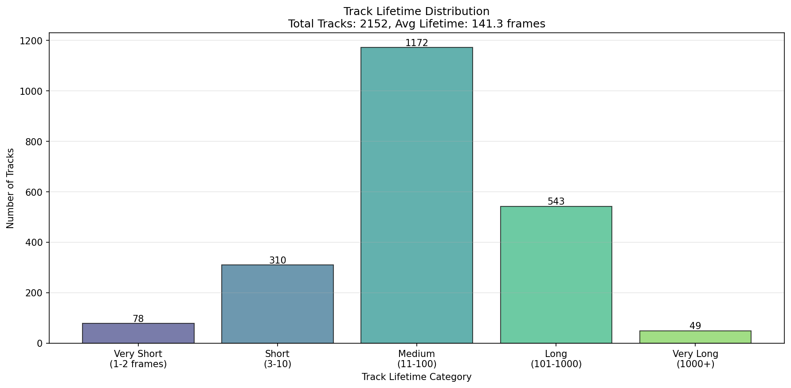
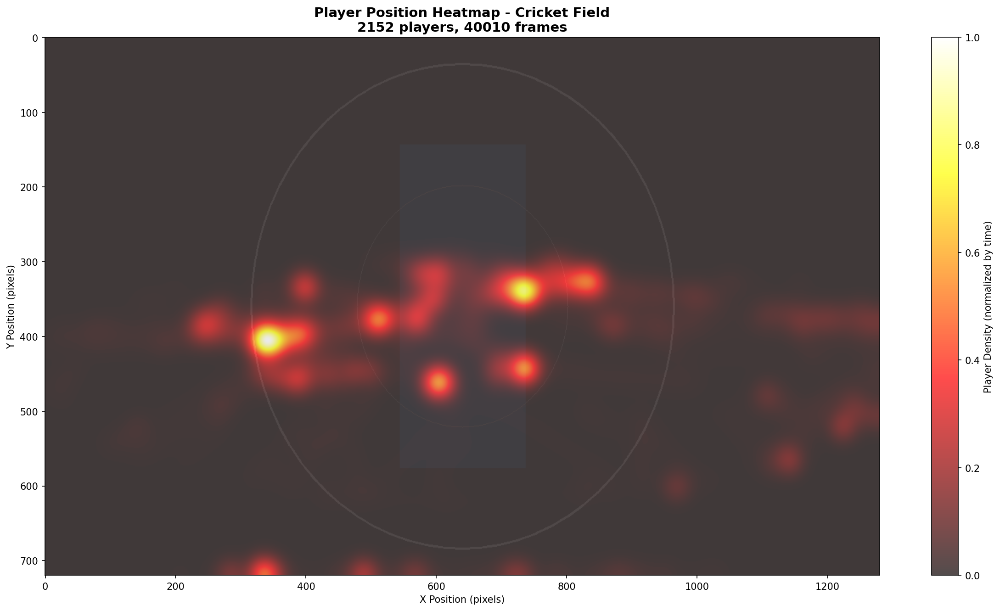
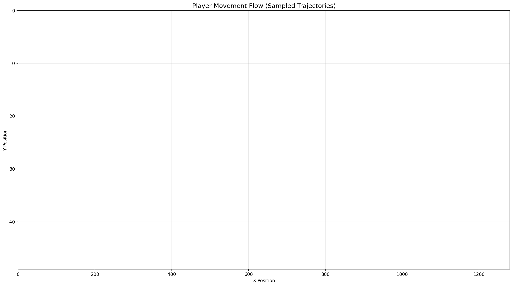
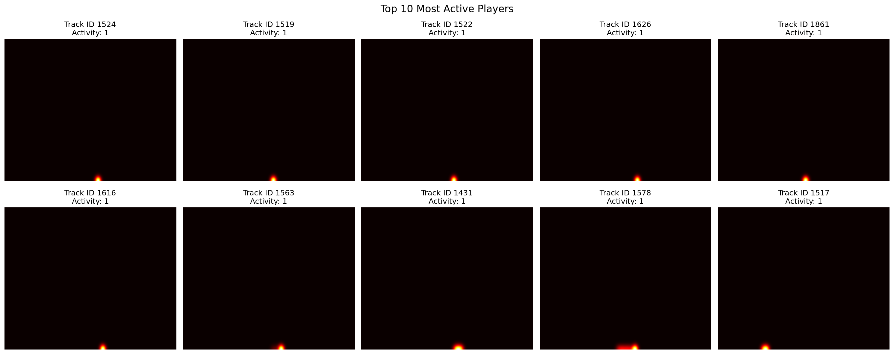
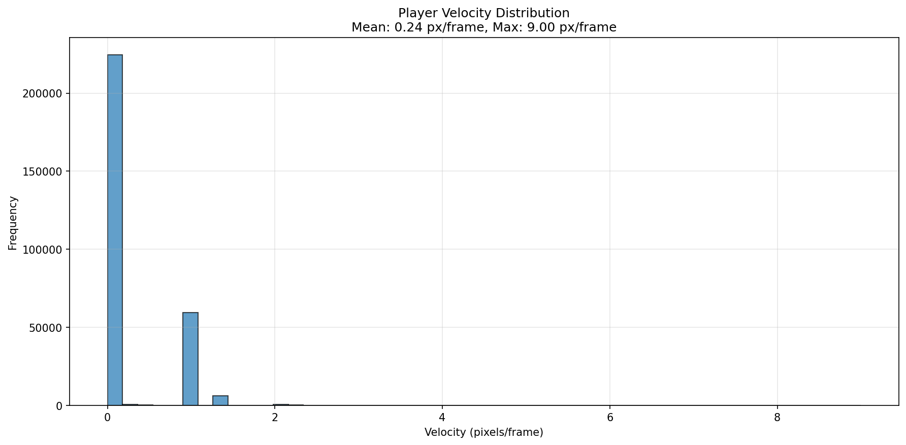
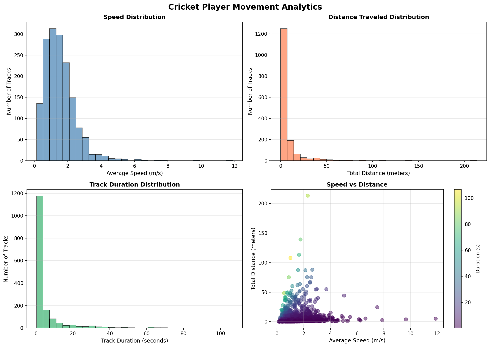
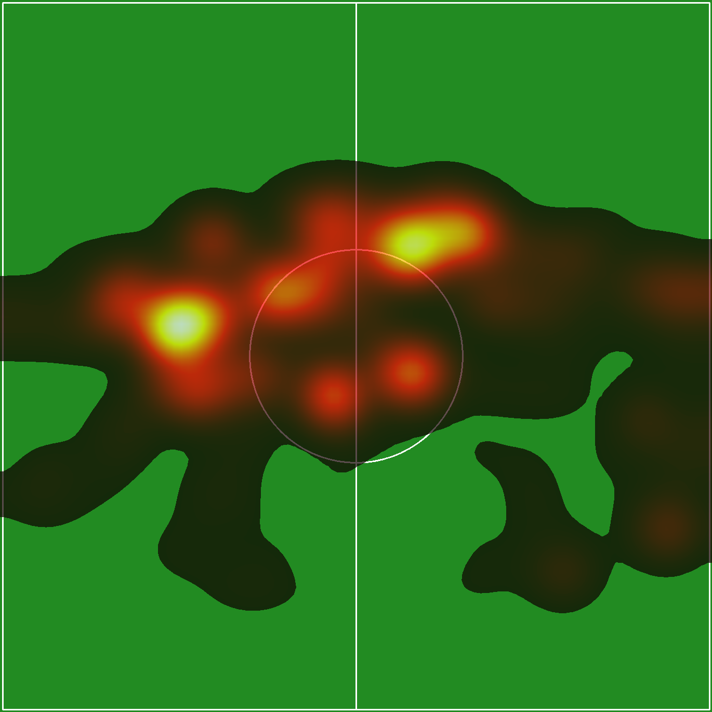
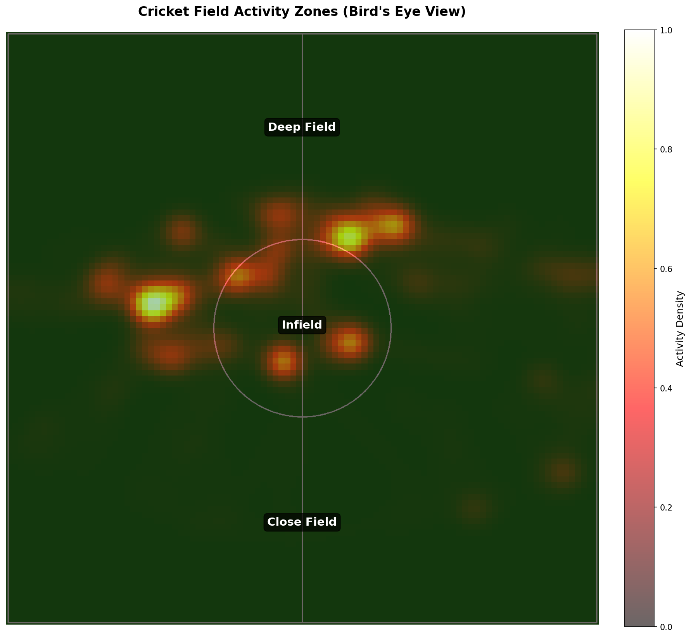
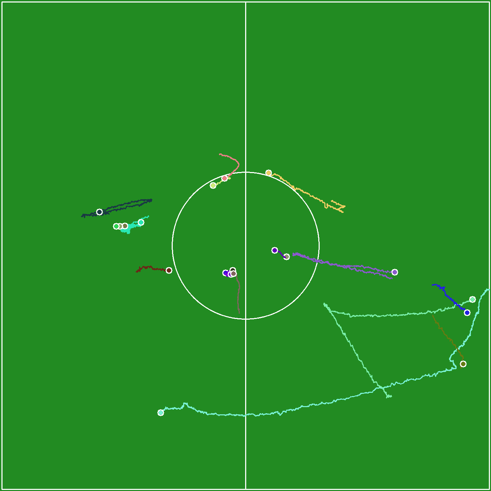
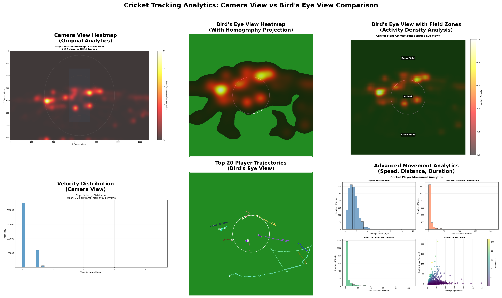

# Cricket Player Tracking & Analytics Pipeline

A multi-object tracking system for cricket match footage. Detects and tracks players across frames with persistent IDs, generating spatial analytics including heatmaps, trajectories, and movement statistics.

---

## Table of Contents

1. [Overview](#overview)
2. [Results & Visualizations](#results--visualizations)
3. [Pipeline Architecture](#pipeline-architecture)
4. [Implementation Details](#implementation-details)
5. [Output Files](#output-files)
6. [Reproducibility](#reproducibility)

---

## Overview

This pipeline processes cricket broadcast footage through four main stages:
1. **Detection**: YOLOv8x person detection on individual frames
2. **Tracking**: ByteTrack algorithm to maintain consistent player IDs across frames
3. **Analytics**: Generate heatmaps and trajectory visualizations (camera view + bird's eye view)
4. **Rendering**: Annotated video output with bounding boxes and track IDs

**Dataset**: 40,010 frames from cricket match broadcast footage

---

## Results & Visualizations

### Tracking Performance

**Statistics from 40,010 frames:**
- Total unique tracks: **2,152**
- Average tracks per frame: **18.6**
- Track lifetime distribution:
  - Very short (1-2 frames): 78 tracks
  - Short (3-10 frames): 310 tracks
  - Medium (11-100 frames): 1,172 tracks
  - Long (101-1000 frames): 543 tracks
  - Very long (1000+ frames): 49 tracks


*Distribution of track lifetimes showing most tracks persist between 11-100 frames, indicating stable tracking through typical player movements and minor occlusions.*

### Video Outputs

**Tracking with Bounding Boxes & IDs**: https://youtu.be/iLB9cvWT7DY  
Shows real-time detection boxes with persistent track IDs overlaid on original footage. Each player maintains a consistent ID number throughout their appearance, with trajectory trails showing recent movement paths.

**Bird's Eye View Projection**: https://youtu.be/xbZX24qSx8w  
Homography-transformed top-down view mapping player positions onto a 2D field representation. Provides tactical perspective for analyzing player formations and spatial coverage.

### Camera View Analytics


*Player position density heatmap from camera perspective. Red zones indicate high-traffic areas where players spend most time. Generated using feet positions accumulated across all frames with Gaussian smoothing.*


*Directional flow visualization showing movement patterns. Arrows indicate common player trajectories, revealing typical paths taken during match play.*


*Individual heatmaps for the 10 most active tracks. Each subplot shows spatial distribution for a single player, useful for analyzing individual coverage patterns.*

### Movement Analytics


*Player velocity histogram showing speed distribution in pixels per frame. Peaks around 0.24 px/frame represent walking speed, with long tail capturing running/sprinting movements.*


*Comprehensive movement statistics including speed distribution (m/s), distance traveled (meters), track duration (seconds), and speed vs distance correlation scatter plot.*

### Bird's Eye View Analytics


*Top-down heatmap with cricket field overlay after homography projection. Provides accurate spatial representation free from perspective distortion, enabling tactical analysis of field positioning.*


*Activity density map divided into cricket-specific zones (deep field, infield, close field). Shows which areas had highest player concentration during the match.*


*Top 20 longest player trajectories visualized on bird's eye view. Each colored line represents one player's complete movement path, useful for understanding individual player coverage.*

### Comparison: Camera View vs Bird's Eye View


*Side-by-side comparison showing the difference between direct camera view analytics (left) and geometrically corrected bird's eye view (right). The bird's eye view enables accurate distance and speed measurements in real-world units (meters, m/s).*

---

## Pipeline Architecture

The pipeline processes cricket footage through four main stages:

### 1. Detection (YOLOv8x)
- **Model**: YOLOv8x pretrained on COCO dataset
- **Configuration**: Person class (class 0) only, 0.3 confidence threshold, 1280px input resolution
- **Hardware**: GPU-accelerated batch processing
- **Output**: Bounding boxes with confidence scores for each frame

### 2. Tracking (ByteTrack)
- **Algorithm**: ByteTrack with conservative parameters optimized for broadcast footage
- **Key Parameters**:
  - `max_age=12` (~0.4s at 30fps) - Quick track removal prevents ID persistence through scene cuts
  - `min_hits=3` - Requires 3 consecutive detections to confirm a track
  - `iou_threshold=0.5` - IoU-based association with Kalman filter prediction
- **Enhancements**:
  - Spatial re-entry gate (reuses IDs for players reappearing near last position)
  - Active track cap of 30 (domain knowledge: 22 players + officials)
  - Track lifetime statistics for quality assessment

### 3. Analytics Generation
Two complementary approaches:

**Camera View Analytics** (Fast - ~12 seconds)
- Direct heatmap generation from camera coordinates
- Velocity and track lifetime distributions
- Optimized: Pixel increment + single Gaussian blur (10,000× speedup)

**Bird's Eye View Analytics** (Accurate - ~45 seconds)
- Homography projection to top-down field view
- 4-point perspective transformation
- True distance/speed measurements in meters and m/s
- Field zones and tactical positioning analysis

### 4. Video Rendering
- Batch-based rendering with encoder restart (prevents memory issues)
- Annotated output with bounding boxes, track IDs, and trajectory trails
- Multiple rendering modes: tracking overlay, bird's eye projection

---

## Implementation Details

### Code Organization

```
pipeline_scripts/
├── data_video/
│   ├── config.py          # Centralized configuration
│   ├── analytics.py       # TrajectoryAnalytics class
│   ├── projection.py      # TopViewProjector (homography)
│   └── visualization.py   # VideoVisualizer & TopViewVisualizer
│
├── local_preprocessing/
│   ├── extract_frames.py  # Video → frames extraction
│   ├── split_batches.py   # Organize frames into batches
│   └── draw_mask.py       # Interactive mask drawing tool
│
└── server_scripts/
    ├── process_batch.py              # YOLO detection per batch
    ├── combine_batches.py            # Merge detection results
    ├── run_tracking_ocsort.py        # Main tracking script
    ├── generate_heatmaps.py          # Camera view analytics
    ├── generate_enhanced_analytics.py # Bird's eye analytics
    ├── render_final.py               # Video rendering
    └── create_comparison_viz.py      # Comparison visualizations
```

### Key Configuration Parameters

```python
# Detection
DETECTION_CONFIG = {
    "model_name": "yolov8x.pt",
    "conf_threshold": 0.3,
    "imgsz": 1280,
    "classes": [0],  # Person only
}

# Tracking
TRACKING_CONFIG = {
    "max_age": 12,
    "min_hits": 3,
    "iou_threshold": 0.5,
    "max_active_tracks": 30,
}

# Bird's Eye Projection
HOMOGRAPHY_CONFIG = {
    "field_width": 105,      # meters
    "field_height": 68,      # meters  
    "output_width": 1050,    # pixels (10px/meter)
    "output_height": 680,
}
```

### Processing Workflow

1. **Local Preprocessing** (on local machine)
   ```bash
   python extract_frames.py video.mp4 --output frames/
   python split_batches.py frames/ --batch-size 500 --output batches/
   ```

2. **Server Detection** (on GPU server)
   ```bash
   for batch in batches/batch_*; do
       python process_batch.py $batch --output detections/
   done
   python combine_batches.py detections/ --output combined_detections.json
   ```

3. **Tracking**
   ```bash
   python run_tracking_ocsort.py combined_detections.json \
       --output tracks_full.json \
       --tracker bytetrack \
       --max-frames 40010
   ```

4. **Analytics**
   ```bash
   python generate_heatmaps.py tracks_full.json --output analytics/
   python generate_enhanced_analytics.py  # Bird's eye view
   ```

---

## Output Files

### Main Outputs

| File | Description | Size |
|------|-------------|------|
| `tracks_full.json` | Complete tracking data with per-frame detections and track IDs | ~150 MB |
| `trajectory_statistics.csv` | Per-track metrics: distance, speed, duration, bounding box ranges | 159 KB |
| `statistics.json` | Summary statistics and tracking configuration | 875 B |

### Analytics Visualizations

**Camera View:**
- `heatmap_overall.png` - Overall player density heatmap (284 KB)
- `heatmap_top10.png` - Individual heatmaps for top 10 players (62 KB)
- `velocity_distribution.png` - Speed distribution histogram (45 KB)
- `track_lifetime_distribution.png` - Track duration analysis (60 KB)
- `movement_flow.png` - Directional flow patterns (43 KB)

**Bird's Eye View:**
- `birds_eye_heatmap.png` - Top-down heatmap with field overlay (262 KB)
- `birds_eye_trajectories_top20.png` - Top 20 player trajectories (62 KB)
- `birds_eye_zones.png` - Field zone activity analysis (80 KB)
- `movement_analytics.png` - Speed/distance/duration stats (199 KB)

**Comparison:**
- `comparison_camera_vs_birdeye.png` - Side-by-side analytics comparison (varies)

---

## Reproducibility

### Full Results (40,010 frames)
All outputs are in `outputs/full_40k_frames/`:
- `tracking/tracks_full.json` - Complete tracking results
- `analytics/` - All analytics visualizations
- `video/` - Rendered videos (if generated)

### Test Subset (30,000 frames)
For reproducibility verification, a 30K frame subset is provided in `outputs/test_30k_frames/`:
- Same pipeline configuration
- Shorter runtime for validation
- Consistent tracking quality metrics

---

## Dependencies

```bash
pip install ultralytics      # YOLOv8
pip install boxmot           # ByteTrack, OC-SORT
pip install supervision      # Annotations
pip install opencv-python    # Image processing
pip install numpy pandas scipy
pip install matplotlib seaborn
pip install tqdm             # Progress bars
```

**Hardware Requirements:**
- GPU with 4GB+ VRAM (tested on NVIDIA A100-SXM4-80GB)
- 16GB+ RAM for processing
- 50GB+ storage for frames and outputs

---

## Limitations & Future Work

**Current Limitations:**
- Manual homography calibration required per camera angle
- No automatic team classification (jersey colors not analyzed)
- Ball tracking not implemented
- Track fragmentation increases with frequent camera cuts/zooms
- Limited to person class detection (no player vs official differentiation)

**Potential Improvements:**
- Automatic field line detection for homography calibration
- Jersey color clustering for team classification
- Ball detection and possession tracking
- Multi-camera fusion for complete field coverage
- Real-time processing optimization (TensorRT/ONNX)
