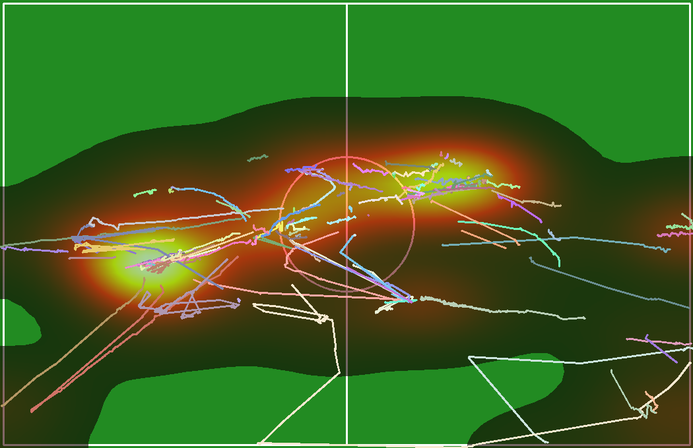

# Sports Player Tracking & Analytics System

A multi-object tracking system for sports video analysis. Takes raw match footage, detects and tracks players across frames, projects their movements onto a bird's-eye field view, and generates analytics like heatmaps and movement statistics.

---

## What This Does

Feed it a sports video, get back:
- Annotated video with player bounding boxes and persistent IDs
- Bird's-eye view video showing player positions mapped to the field
- Heatmaps showing where players spent the most time
- Trajectory visualizations of movement patterns
- CSV exports with per-player statistics (distance, speed, duration)

---

## Results

Processed a 13.4-minute match video (40,245 frames at 50 FPS, 1920x1080 resolution).

**Processing Stats:**
- Total processing time: 35.8 minutes
- Speed: 18.72 FPS with batch size 16
- Trajectory points collected: 16,897
- Unique players tracked: 176
- Full trajectories (30+ frames): 128

### Video Links

Applying Detections and Tracking on Sample Video:- https://youtu.be/iLB9cvWT7DY

Projection to get bird's eye view and tracing data for each Id(Stored as CSV file):- https://youtu.be/xbZX24qSx8w


### Heatmap
Spatial density of player positions. Red zones show high-traffic areas, blue zones show rarely occupied space.


### Trajectory Paths
Movement paths for all tracked players throughout the match. Each color represents a different player.


### Combined Analysis
Heatmap overlaid with trajectory paths for a complete spatial picture.



---

## How It Works

**Detection**: YOLOv8x (extra-large variant) pretrained on COCO dataset. Class 0 (person) detection with confidence threshold 0.3. The model runs at 1280px input resolution to catch distant players.

**Tracking**: ByteTrack algorithm via the Supervision library. Uses IoU-based association with Kalman filter prediction. Maintains lost tracks for 30 frames to handle temporary occlusions. No appearance model needed - pure motion-based tracking.

**Projection**: Manual 4-point homography calibration. Select four court corners in the video frame, map them to a 1050x680 pixel field template (10 pixels per meter for a standard 105m x 68m field). OpenCV handles the perspective transformation.

**Analytics**: Positions accumulated per frame. Heatmaps computed using 2D histogram with Gaussian smoothing (sigma=3). Trajectories smoothed with moving average filter. Per-player stats calculated from displacement vectors.

---

## Code Structure

### config.py
Central configuration file. All hyperparameters live here - detection thresholds, tracking parameters, field dimensions, visualization settings. Change values here instead of hunting through code.

### detection.py
Wraps YOLOv8x model. Handles single-frame and batch inference. Extracts bounding boxes, confidence scores, and class IDs. Also provides helper methods to get bbox centers and bottom-centers (foot positions for ground-plane projection).

### tracking.py
Two classes here. `PlayerTracker` wraps ByteTrack from the Supervision library - takes detections, returns detections with consistent track IDs. `TrackHistory` stores position history per track for trajectory visualization.

### projection.py
`TopViewProjector` class handles the homography math. Set source points (video frame corners) and destination points (field template corners), get back a transformation matrix. Projects individual points or entire frames. Includes bounds checking to filter out invalid projections.

### analytics.py
`TrajectoryAnalytics` accumulates all position data. Stores frame-by-frame positions in memory, exports to DataFrame/CSV. Computes heatmaps using histogram + Gaussian filter. Calculates per-track statistics: total distance, average speed, max speed, time on field.

### visualization.py
Two visualizers. `VideoVisualizer` uses Supervision's annotators for bounding boxes, labels, and trajectory traces on the original video. `TopViewVisualizer` renders the bird's-eye view - draws field template, player positions, trajectory lines, and heatmap overlays.

### main.py
`PlayerTrackingPipeline` class orchestrates everything. Opens video, runs detection/tracking loop, handles projection if calibration points provided, writes output videos, generates analytics at the end. CLI interface with argparse.

---

## Output Files

| File | Description |
|------|-------------|
| `tracked_video.mp4` | Original video with bounding boxes, track IDs, confidence scores, and info overlay |
| `topview_video.mp4` | Bird's-eye view with player dots and trailing paths |
| `heatmap.png` | Gaussian-smoothed density map of all player positions |
| `trajectory_paths.png` | Complete movement paths for all tracked players |
| `combined_analysis.png` | Heatmap + trajectories overlay |
| `trajectories.csv` | Raw data: frame index, track ID, x position, y position |
| `player_statistics.csv` | Per-player: distance traveled, avg/max speed, time on field |

---

## Quick Start

```bash
pip install -r requirements.txt

python main.py path/to/video.mp4 --output results/
```

With homography calibration for bird's-eye view:
```bash
python main.py video.mp4 --output results/ --source-points "288,270,1632,270,1824,918,96,918"
```

The source points are x,y coordinates of four field corners in the video frame (top-left, top-right, bottom-right, bottom-left order).

---

## Configuration

Key parameters in `config.py`:

```python
# Detection
conf_threshold = 0.3    # Lower = more detections, higher = fewer false positives
imgsz = 1280            # Input resolution - higher catches distant players

# Tracking  
track_buffer = 30       # Frames to keep lost tracks before dropping
match_thresh = 0.8      # IoU threshold for associating detections to tracks

# Homography
output_width = 1050     # Field template width (10 px/meter)
output_height = 680     # Field template height (10 px/meter)
```

---

## Challenges Solved

**Corrupted Video Files**: 2 of 3 provided videos had incomplete MP4 headers (moov atom not found). Validated with ffprobe, attempted repair with ffmpeg, ultimately focused on the one working video.

**Projection Artifacts**: Players near frame edges sometimes projected outside field boundaries due to perspective distortion. Added bounds filtering in `TopViewProjector.filter_out_of_bounds()` to clean output.

**Track-Detection Sync**: Tracked detections don't always align 1:1 with original detections after ByteTrack processing. Used dictionary-based confidence mapping instead of array indexing to handle this gracefully.

---

## Dependencies

- ultralytics (YOLOv8)
- supervision (ByteTrack, annotations)
- opencv-python
- torch (CUDA support)
- numpy, pandas, scipy
- matplotlib, tqdm

See `requirements.txt` for versions.

---

## Hardware

Tested on NVIDIA A100-SXM4-80GB with CUDA 12.1. Should run on any CUDA-capable GPU with 4GB+ VRAM. Falls back to CPU if no GPU available (slower).

---

## Limitations and Future Work

Current limitations:
- Manual homography calibration required per video
- No team classification (all players tracked as same class)
- No ball tracking
- Processing speed below real-time

Potential improvements:
- TensorRT/ONNX optimization for faster inference
- Automatic field line detection for calibration
- Jersey color clustering for team separation
- Ball detection and possession tracking

---

## Project Structure

```
config.py
detection.py
tracking.py
projection.py
analytics.py
visualization.py
main.py
requirements.txt
outputs/
    heatmap.png
    trajectory_paths.png
    combined_analysis.png
    trajectories.csv
    player_statistics.csv
    ANALYSIS_REPORT.txt
```

---
